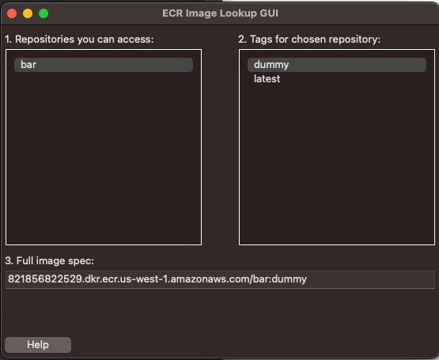
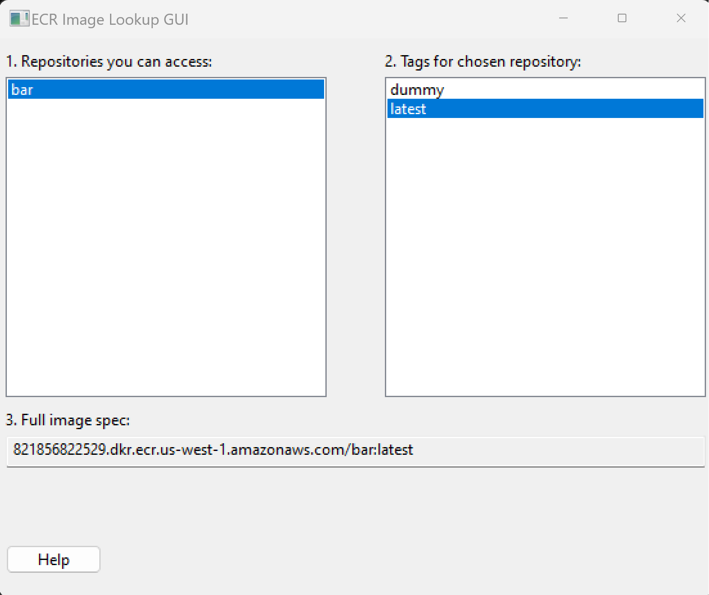

# py_gui_tinker
This repository houses code for wrapping AWS ECR to scrape repositories and tags the caller has access to.
This requires being able to describe all images, then we only keep repository names for which we can list tags.
This has been tested on MacOS and Windows.

## Setup
You will need `boto3` and `wxPython` installed on Python 3.x.  You will also need to install the AWS CLI, then
run `aws configure` to have credentials stored or however you authenticate with AWS.

## Screenshots
### MacOS

### Windows
