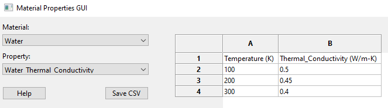

# py_gui_tinker
This repository houses code for querying a MySQL database for materials and their associated properties.  Current features include the following:
* Establishing a materials list from the DB
* Selection of properties for a given material
* Exporting material property data
    * Via copy and paste into Excel
    * Saving as a CSV file
    
Future work may include unit conversion using the `pint` library, but overall feasibility is yet to be determined.  Shown below is an example of the GUI in action.

